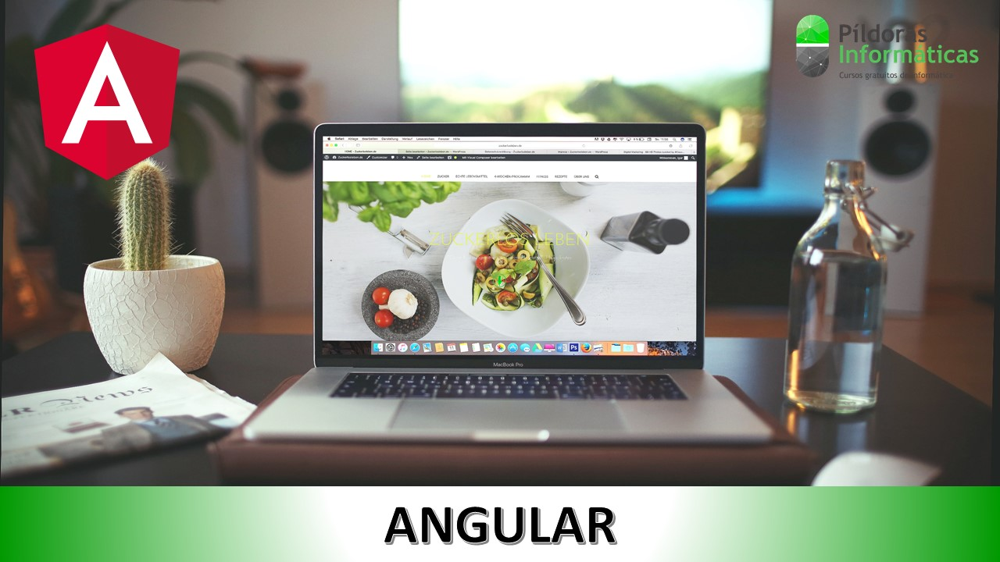

# angular-course

This apps has been developed in this course [Curso Angular](https://www.pildorasinformaticas.es/course/curso-angular/curriculum/).

## Repository code overview

- miprimeraApp - first steps.
- MiniCalculatorApp - components, interpolation and binding.
- trabajoDirectivaApp - directives.
- app-employees - components communication, services and routing.
- app-employees-routing - Firebase database, login, page protection and application deployment.

